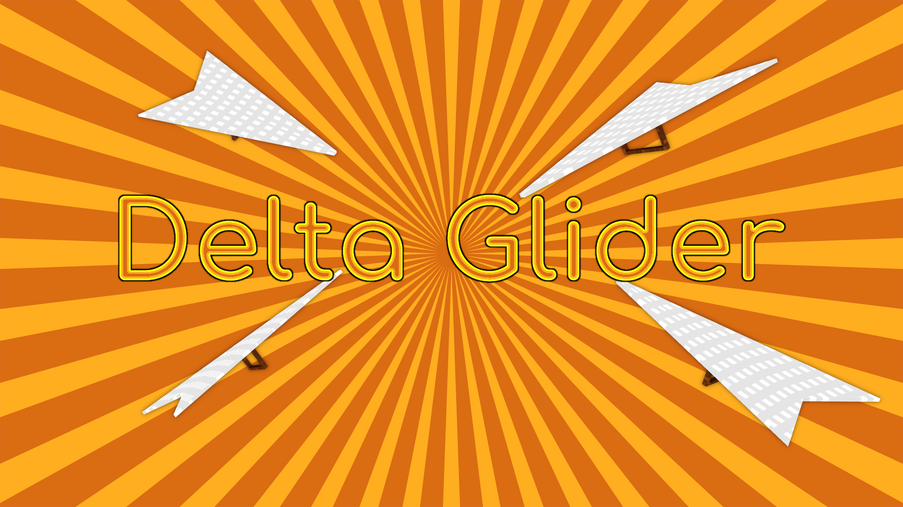

# Delta Glider: A Realistic Delta Hang Glider Mod

Have you ever wanted to glide through the mountains and feel the wind rushing
by you?

Well now, you can!

This [deltaglider] mod adds two items: the glider itself, and a rocket used to
boost your speed.

Punch while holding the glider to take off and soar.

The glider will close when you hit something or when you punch with the glider
again.

While holding glider and not pointing at any node or object, you can:
- Hold sneak key and place (right-click) to toggle between mouse and keyboard
controls.
- Hold sneak and special (aux1 aka run) keys and place to toggle vertical inverted
control on/off.

Consult [settingtypes.txt](settingtypes.txt) to see various possible server
settings that influence the availability of control toggles, rockets, wear of
glider etc.

With [[areas](https://github.com/minetest-mods/areas)], this mod supports FLAK
just like [[hangglider](https://github.com/mt-mods/hangglider)] does. FLAK can
optionally be restricted by privs and/or XP
([[xp_redo](https://github.com/mt-mods/xp_redo)]).

There are settings to restrict the usage of
[[hangglider](https://github.com/mt-mods/hangglider)] at the same time as
this glider.

Other mods can register flight-check functions to disallow flight in
certain areas, mediums etc. They can also damage or heal the glider with
these pre-flight and in-flight check functions.

See the comments in [init.lua](init.lua) above the
``deltaglider.register_grounded_check(func)`` function.

Known issue: Pro mouse controls don't work nicely in first person view.

